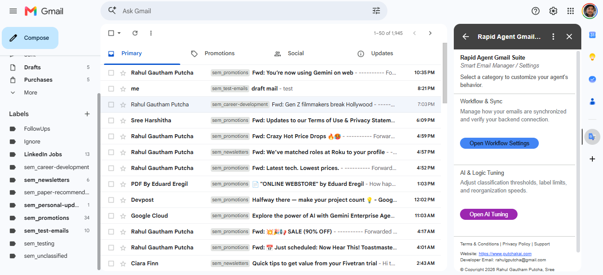
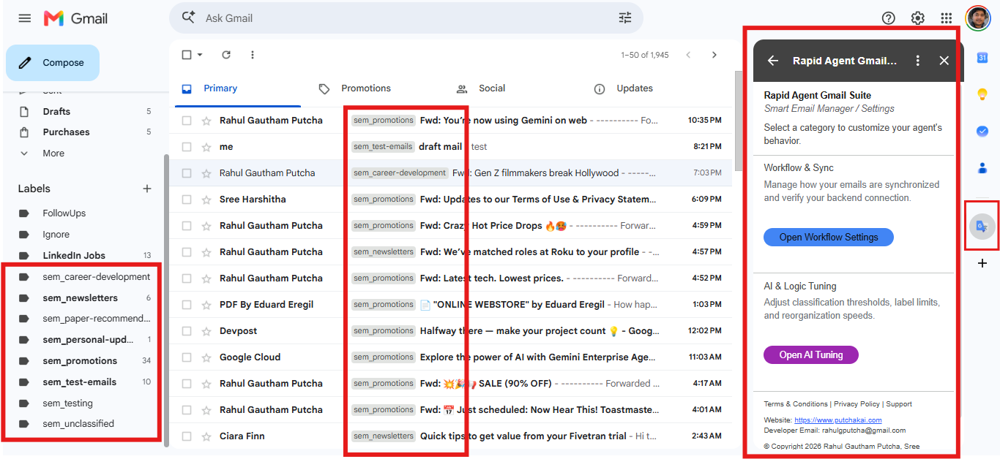

# Smart Email Manager

Automate your inbox using the power of MongoDB Atlas, Vector Search, and Agentic AI. This project provides a "one-click" deployment for a smart email organizer that semantically classifies and groups your emails.

## Description

Smart Email Manager is an AI-powered agent designed to help you regain control over your Gmail inbox. It uses MongoDB Atlas Vector Search to understand the semantic meaning of your emails and automatically applies labels, groups related messages, and helps you prioritize your communication.

Built for the **Google Rapid Agent Hackathon**, this agent leverages the Model Context Protocol (MCP) to interact directly with Gmail, while using MongoDB as a long-term semantic memory and storage engine.

## Key Features

- **Semantic Classification:** Automatically categorize emails based on their content, not just keywords.
- **Vector Search:** Find related emails using semantic similarity with MongoDB Atlas Vector Search.
- **Gmail Integration:** Seamlessly interacts with Gmail to create labels, apply them to messages, and fetch email data.
- **Cloud Run Ready:** Containerized and ready for deployment on Google Cloud Run with automated scripts.
- **MongoDB Atlas Integration:** Uses MongoDB for storing email metadata and vector embeddings for fast, scalable semantic lookups.

## Use Cases

1.  **Automated Inbox Organization:** Automatically label incoming invoices, project updates, or travel confirmations.
2.  **Semantic Email Search:** Search for "financial documents" and find invoices, receipts, and bank statements even if they don't contain the word "financial".
3.  **Intelligent Email Grouping:** Group unclassified emails that share similar semantic themes for batch processing.
4.  **Customer Support Triage:** Automatically tag support emails by topic (e.g., "billing", "technical-issue", "feature-request").

## Screenshots

| Dashboard | Components |
| :---: | :---: |
|  |  |

## Setup & Deployment Guide (Local & Cloud)

This guide provides the comprehensive path to deploy the Smart Email Manager stack.

### Step 0: Prerequisites

Before you begin, ensure you have the following accounts and keys:

1.  **MongoDB Atlas**:
    - Create a free account at [mongodb.com/atlas](https://www.mongodb.com/cloud/atlas/register).
    - **Create a Project** and a **Cluster** (Shared/Free Tier).
    - **Database Access**: Create a user with **"Read and write to any database"** permissions.
    - **Network Access**: Add **`0.0.0.0/0`** (Allow Access from Anywhere) for development.
    - **Connect**: Copy your **Connection String (MONGO_URI)**.

2.  **Voyage AI**:
    - Sign up at [voyageai.com](https://www.voyageai.com/).
    - Go to **API Keys** and copy your **API Key**.

### Step 1: Initialize Environment

1.  **Install dependencies:**
    ```bash
    pip install -r requirements.txt
    ```

2.  **Configure Environment Variables:**
    Create a `.env` file or set them in your environment:
    ```env
    MONGO_URI=your_mongodb_atlas_connection_string
    VOYAGE_API_KEY=your_voyage_ai_api_key
    ```

3.  **Google API Setup:**
    - Place your `credentials.json` (OAuth 2.0 Client ID) in the root directory.
    - Run the agent to complete the OAuth flow:
      ```bash
      python tools/gmail_mcp.py
      ```

### Step 2: Provision Identity & Permissions (GCP)

If deploying to Google Cloud, follow these steps:

1.  **Grant Deployment Roles**:
    ```bash
    PROJECT_ID=$(gcloud config get-value project)
    USER_EMAIL=$(gcloud config get-value account)

    gcloud projects add-iam-policy-binding $PROJECT_ID --member="user:$USER_EMAIL" --role="roles/run.admin"
    gcloud projects add-iam-policy-binding $PROJECT_ID --member="user:$USER_EMAIL" --role="roles/discoveryengine.admin"
    gcloud projects add-iam-policy-binding $PROJECT_ID --member="user:$USER_EMAIL" --role="roles/pubsub.admin"
    gcloud projects add-iam-policy-binding $PROJECT_ID --member="user:$USER_EMAIL" --role="roles/aiplatform.user"
    ```

### Step 3: Deploy Backend (Cloud Run)

1.  **Build and Push Container**:
    ```bash
    gcloud builds submit --tag gcr.io/$PROJECT_ID/smart-email-manager-agent .
    ```

2.  **Launch Service**:
    ```bash
    gcloud run deploy smart-email-manager-agent \
      --image gcr.io/$PROJECT_ID/smart-email-manager-agent \
      --platform managed --region us-central1 --allow-unauthenticated --port 8080
    ```

## Architecture


The agent uses:
- **FastAPI:** To provide a web interface and OAuth callback endpoints.
- **FastMCP:** To bridge the AI agent with Gmail tools.
- **MongoDB Atlas:** For data persistence and vector search.
- **Voyage AI:** For high-quality text embeddings.
